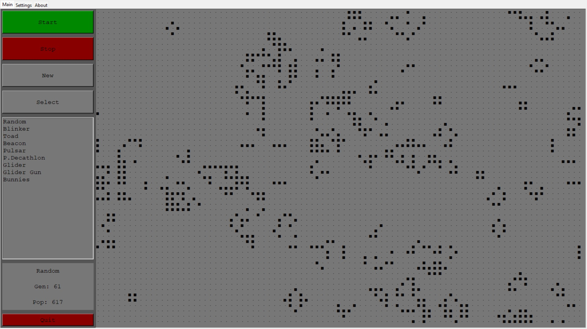

# Conway's Game of Life
> A functinal GUI application to simulate _John Conway's_ [_Game of Life_](https://en.wikipedia.org/wiki/Conway%27s_Game_of_Life) utilizing Python.





# About
  This application provides a full graphical user interface to simulate the famous [cellular automaton](https://en.wikipedia.org/wiki/Cellular_automaton) Game of Life. The **rule set** was devised by English mathematician [John Conway](https://en.wikipedia.org/wiki/John_Horton_Conway) in 1970. The universe of the Game of Life is a two-dimensional matrix of square cells. Traditional simulations allow the matrix to be infinite, but this simulation provides "pac-man connectivity" where the horizontal and vertical edges of the matrix connect back onto itself. Each cell is in either two states, alive or dead. Every cell is connected to it's neighboring eight cells; i.e. the cells horizontally, vertically, and diagonally adjacent. Cells at the edge refer the opposite edge's cells as neighbors. The simulation iterates through generations, where the state of each generate is determined by the **rule set**:
  
>1. Any live cell with fewer than two live neighbours dies, as if by underpopulation.
>2. Any live cell with two or three live neighbours lives on to the next generation.
>3. Any live cell with more than three live neighbours dies, as if by overpopulation.
>4. Any dead cell with exactly three live neighbours becomes a live cell, as if by reproduction.
  
The application was constructed fully in Python. The GUI was constructed with python's native tkinter GUI library. Data files are formatted with TOML. 


## Installation

OS X & Linux:

```sh
npm install my-crazy-module --save
```

Windows:

```sh
edit autoexec.bat
```

## Usage example

A few motivating and useful examples of how your product can be used. Spice this up with code blocks and potentially more screenshots.

_For more examples and usage, please refer to the [Wiki][wiki]._

## Requirements
Python:
   * version: 3.12.26
    
Python Libraries:
* toml
   * version: 0.10.2

## Release History

* 1.0.0 (10/20/2024)
   * Release of Conway's Game of Life application.

## Meta

Robert Hunt - ig: [@furtiveplant](https://www.instagram.com/furtiveplant/) - X: [@FurtivePlant](https://x.com/FurtivePlant) - finalrob@gmail.com

[https://github.com/hectic4491/gameoflife](https://github.com/hectic4491/gameoflife)
